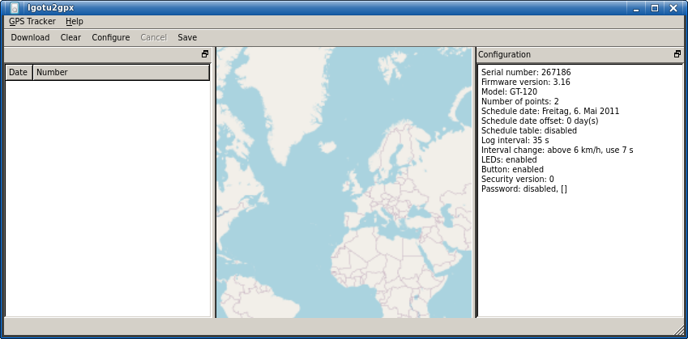

Free GUI utility to provide Linux/Mac OS X support for the MobileAction i-gotU USB GPS travel loggers
=====================================================================================================

This repository is not the source itself. It is only the code for building a working AppImage.

Sources
-------

The sources come from https://code.launchpad.net/igotu2gpx, or more exactly from https://bazaar.launchpad.net/~igotu2gpx/igotu2gpx/trunk/revision/227

The License of the original source code, contained in the file src/igotu2gpx_bzr227.tar.xz, is GPLv3

### Patches

I wrote two patches for this:

marbledatadir.patch, to make it possible to change the marble (world map) datafile paths by environment varibles. These variables are set in the launcher extra/igotugui-launcher.c

y2016.patch, the devices store timestamps with a 4-bit year. This means, the numbers 0..15 can be represented. This means that for the device, the years 2000, 2016 and 2032 are the same, and likewise with other years. This patch shifts the year to a plausible value when using after 2016.

Notes
-----

AppImage has extra support for packing qt5 code. Unfortunately, this is qt4 code, and I had to do some hacks to get it working. See build.sh.
This is also the reason why I built this AppImage. The original code compiles for Ubuntu 14.04, newer versions lack support for qt4. This package has successfully been tested unter Ubuntu 22.04 though.

License
-------

I publish this unter MIT licence. Use this repo (the packaging project) whereever you want, and for whatever you want. Take it as inspiration for your own piece of software.
Anyway, I'm always happy to hear if my code was used somewhere. Or if you mention my name there. But no requirement.
